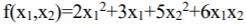

# ***Questions***

### ***Q1. True or False: in the Bagging algorithm the size of the ensemble built is always equal to the number of iterations (models) determined by the user.***

- [x] True
- [ ] False

***Explanation*** - In the Bagging algorithm the user inputs a base learner, number of iterations and n as input. In each iteration a bootstrap sample of size n is selected and a base learner is trained on this sample. At the end the models are combined.

### ***Q2. True or False: training time of LOOCV (Leave one-out Cross Validation) on a table with 100 examples is at least 10 times longer than the 10-CV Folds training time on this table.***

- [x] True
- [ ] False

***Explanation*** - LOOCV is a special case of k-Fold Cross-Validation where k is equal to the size of data (n) so LOOCV = 100-cv Folds. In 100-cv Folds we train 100 model and in 10-CV Folds we train 10 models so its at least 10 times longer because in the 100-cv Folds each model is trained on more data than in 10-CV Folds.

### ***Q3. True or False: it is always possible to find an accurate solution for the classifier variables with analytical methods regardless of the type of classifier constructed.***

- [ ] True
- [x] False

***Explanation*** - We prefer the analytical method in general because it is faster and because the solution is exact. Nevertheless, sometimes we must resort to a numerical method due to limitations of time or hardware capacity. For example when we cannot fit all the data into the memory of a single computer in order to perform the analytical calculation. Also, sometimes the analytical solution is unknown and all we have to work with is the numerical approach.

### ***Q4. True or False: one of the advantages of the Bagging algorithm over the AdaBoost algorithm is that Bagging can be performed in parallel without any change in code, so each classifier is built on a different processor/computer.***

- [x] True
- [ ] False

***Explanation*** - Bagging is a parallel method that fits different, considered learners independently from each other, making it possible to train them simultaneously.

### ***Q5. True or False: the original SVM algorithm is intended for solving binary problems only.***

- [X] True
- [ ] False

***Explanation*** - SVMs (linear or otherwise) inherently do binary classification. However, there are various procedures for extending them to multi-class problems.

### ***Q6. True or False: the original AdaBoost algorithm is intended for solving binary problems only.***

- [x] True
- [ ] False

***Explanation*** - AdaBoost in its original form was designed for binary classification. It has been proved that this classifier is extremely successful in producing accurate classification when applied to two-class classification problems. AdaBoost was also proposed to be used as multi-class classifier by Freund and Schapire.

### ***Q7. True or False: Trying to solve a multiclass classification problem where clases are {a,b,c,d} using ECOC with 3 models. model 1 is intended to distinguish between the group {a,b} and {c,d}. model 2 is intended to distinguish between the group{a,c} and {b,d}. model 3 is intended to distinguish between the group {a,d} and {b,c}. If the models classified a new observation to groups 1,0,1 respectively then the observation should be assigned to group c.***

- [x] True
- [ ] False

***Explanation*** - {c,d} & {a,c} & {n,c} = {c}.

### ***Q8. True or False: increasing the number of neurons in the hidden layer of a three-layer neural network will usually reduce the bias***

- [x] True
- [ ] False

***Explanation*** - The more neurons in the hidden layer the more we can fit the network to our data and by that reduce the bias. The bias reduces as the model complexity grows.

### ***Q9. True or False: increasing the number of neurons in the hidden layer of a three-layer neural network will usually increase accuracy on the test group.***

- [ ] True
- [x] False

***Explanation*** - The more neurons in the hidden layer the more we can fit the network to our data and lead to overfitting  which will reduce test accuracy.

### ***Q10. True or False: bias reduction will inevitably lead to an increase in variance***

- [ ] True
- [x] False

***Explanation*** - Although there is a bias-variance trade off it is not guarantee that reducing the bias will inevitably lead to an increase in variance.

### ***Q11. True or False: given the function . If there is an optimum point then Newton's method will inevitably find the exact solution within one iteration regardless of the starting point Search***

- [ ] True
- [x] False

***Explanation*** - Newton's method has a quadratic convergence but it depends on the step size and starting point so it will not always converge in exact one iteration.

### ***Q12. True or False: the difference between Ensemble and Mixtures of Experts, is that in Ensemble classifiers are created from the same Basic algorithm and in MoE this is usually not the case.***

- [ ] True
- [x] False

***Explanation*** - In ensemble we use a lot of algorithms and combine them but in MoE we use a small number of models where each model specializes in some aspect. the models in MoE can be from the same basic algorithm.

### ***Q13. True or False: each multilayer neural network can be described using a three-layer network.***

- [x] True
- [ ] False

***Explanation*** - 

### ***Q14. True or False: in the Associative Auto neural network, the original information can always be restored without errors.***

- [ ] True
- [x] False

***Explanation*** - Associative Auto neural network cannot guarantee complete restoration always.

### ***Q15. True or False: in the SVM algorithm, the dual representation is intended to allow the use of Kernel without the explicit knowledge of the conversion function.***

- [x] True
- [ ] False

***Explanation*** - The dual representation enables us to use the kernel trick. The ultimate benefit of the kernel trick is that the objective function we are optimizing to fit the higher dimensional decision boundary only includes the dot product of the transformed feature vectors. Therefore, we can just substitute these dot product terms with the kernel function, and we don’t even use ϕ(x).

### ***Q16. True or False: based on the "No Free Lunch" principle, no learning algorithm can be found that surpasses all the other algorithms in a given problem.***

- [ ] True
- [x] False

***Explanation*** - The “no free lunch” (NFL) theorem implies that no single machine learning algorithm is universally the best-performing algorithm for all problems.

### ***Q17. True or False: according to the Occam razor, if two models have the same error on the training set, then the simpler model should be preferred.***

- [x] True
- [ ] False

***Explanation*** - The Occam’s Razor in applied machine learning (Occam’s Two Razors) states that given two models with the same training-set error, the simpler one should be preferred because it is likely to have lower generalization error.

### ***Q18. True or False: existence of KKT conditions for a non-quadratic problem, represents the necessary condition for a global optimal solution.***

- [ ] True
- [x] False

***Explanation*** - 

### ***Q19. True or False: increasing the number of neurons in the hidden layer of a three-layer neural network will usually increase accuracy on the train group.***

- [x] True
- [ ] False

***Explanation*** - The more neurons in the hidden layer the more we can fit the network to our data and lead to overfitting  which will increase train accuracy.

### ***Q20. True or False: in the Associative Auto neural network with 4 input nodes and two nodes in the hidden layer, the original information can always be restored without errors.***

- [ ] True
- [x] False

***Explanation*** - Associative Auto neural network cannot guarantee complete restoration always.

### ***Q21. True or False: existence of KKT conditions for a quadratic problem, represents the sufficient condition for a global optimal solution.***

- [x] True
- [ ] False

***Explanation*** - 

### ***Q22. The goal is to classify image x to one of the two classes A,B. The the priori probabilities are P(A) = 0.4, P(B) = 0.6. The probability of obtaining the above x given A is 0.7 Whereas the probability of obtaining the above x given B is 0.3. According to the Naïve Bayess method, the class that must be chosen to minimize the mistake expected value is B.***

- [ ] True
- [x] False

***Explanation*** - P(A|x) = P(A) \* P(x|A) = 0.28, P(B|x) = P(B) \* P(x|B) = 0.18.

### ***Q23. True or False: in most cases the accuracy of the first classifier built by the AdaBoost Ensemble has a greater accuracy than the accuracy of first classifier built by the Bagging Ensemble.***

- [x] True
- [ ] False

***Explanation*** - In Bagging each classifier is built on a sample of the data or features but in AdaBoost each classifier is trained on the full weighted data and features so the first classifier in AdaBoost has more data and features to learn on so its accuracy should be greater than the first classifier build with random forest.

### ***Q24. The ML team received a file with new training data. The task is to create a new classification model based on this data. The input features are nominal only. Also the target attribute is binary. The team is debating between five possible classifiers: KNN, ID3, Naive Bayes, OneR, C4.5. To select the best classifier, it was decided to linearly weight the output of these classifiers (The probabilities for each CLASS). Which Ensemble method is suitable for this case?***

***Answer & Explanation*** - Stacking, Stacking is a way to improve model predictions by combining the outputs of multiple models and running them through another machine learning model.

### ***Q25. Given a training set that includes 100 attributes and 100 observations - which Ensemble method do you recommended to use (only one ensemble method). Explain why.***

***Answer & Explanation*** - Bagging, because it uses bootstrapping.

### ***Q26. Multi-class problems can be solved by converting to a number of binary classification problems (with binary classifications only). Explain how the conversion is recommended. Explain in which cases this method is required.***

***Answer & Explanation*** - Many algorithms such as the Perceptron, Logistic Regression, and Support Vector Machines were designed for binary classification and do not natively support classification tasks with more than two classes. So we need to find a way to use these algorithms for multi-class classification. this can be done using One-vs-One or One-vs-All.

### ***Q27. True or False: in the AdaBoost algorithm the level of accuracy on the test set may continue to improve even when the level the accuracy of the train set reached 100%***

- [x] True
- [ ] False

***Explanation*** -  This question is answered by Schapire and Freund, et. al. Even when the training error is zero, the margin (= sample distance to decision boundary) is still improved by further boosting iterations. This can lead to improving the test set accuracy even the train set reached 100%.

### ***Q28. True or False: if the AUC of model A is higher than that of model B, then the accuracy of model A is necessarily higher than that Of model B***

- [ ] True
- [x] False

***Explanation*** - Accuracy is computed at the certain threshold (usually 0.5). While AUC is computed by adding all the "accuracies" computed for all the possible threshold values. ROC can be seen as an average (expected value) of those accuracies when are computed for all threshold values.

### ***Q29. True or False: the Error-Correcting Output Codes approach is designed to enable classification trees to address Multi-Class problems.***

- [x] True
- [ ] False

***Explanation*** - The Error-Correcting Output Codes method is a technique that allows a multi-class classification problem to be reframed as multiple binary classification problems, allowing the use of native binary classification models to be used directly.

### ***Q30. True or False: for the purpose of thinning a forest of trees, it is advisable to dilute trees with a low correlation with the target feature and / or other trees.***

- [ ] True
- [ ] False

***Explanation*** - 

### ***Q31. True or False: the RNN model allows, among other things, to study a model that receives as a sequence input of values and emits a single value***

- [x] True
- [ ] False

***Explanation*** - Recurrent Neural Networks(RNN) are a type of Neural Network where the output from the previous step is fed as input to the current step. RNN's are mainly used for, Sequence Classification — Sentiment Classification & Video Classification. Output of an rnn can be a single value (single-output-rnn).

### ***Q32. True or False: the rule of thumb that the number of neurons in the middle layer is equal to the algebraic mean of the number of neurons in the input layer and output layer do not match the AutoEncoder model***

- [x] True
- [ ] False

***Explanation*** - In the AutoEncoder model number of neurons in the input and output layers are the same so an algebraic mean will be the same so all the layers will have the same dimensions which will not allow dimension reduction and learning of the input representation.

### ***Q33. True or False: in order to build a Stacked AutoEncoder model all observations must include the value of the target attribute.***

- [ ] True
- [x] False

***Explanation*** - The input and output of the a Stacked AutoEncoder is the observation itself so no need of the target attribute.

### ***Q34. True or False: in the SVM model with the Kernel function It is necessary to know the explicit function of translating the observations from the original space to the new space.***

- [ ] True
- [x] False

***Explanation*** - The ultimate benefit of the kernel trick is that the objective function we are optimizing to fit the higher dimensional decision boundary only includes the dot product of the transformed feature vectors. Therefore, we can just substitute these dot product terms with the kernel function, and we don’t even use ϕ(x).

### ***Q35. True or False: the CNN model is for image classification only.***

- [ ] True
- [x] False

***Explanation*** - You can apply CNN on any kind of data if you define the dimension of the data in a way that CNN can understand.

### ***Q36. True or False: the running time required to study a single tree according to C4.5 algorithm  is greater than the running time required to study a randomForest with a single tree.***

- [x] True
- [ ] False

***Explanation*** - Each tree in a random forest is not trained on all sample\features meaning if we train only one tree it should take lees than training a single C4.5 which uses all sample\features to builds a tree.

### ***Q37. True or False: in the steepest descent method the search direction is always a descent direction.***

- [x] True
- [ ] False

***Explanation*** - Steepest descent involves looking at the steepness of the hill at their current position, then proceeding in the direction with the steepest descent(i.e., downhill).

### ***Q38. True or False: Newton's method is good for converging to the minimum region even when the starting point is not close to the point the optimum.***

- [ ] True
- [x] False

***Explanation*** - If the guess is not close enough it can cause the method to approximate the wrong root or the method will diverge entirely.

### ***Q39. True or False: logistic regression is suitable for solving binary classification problems and multi-class problems.***

- [ ] True
- [x] False

***Explanation*** - Logistic regression in its original form is intended for binary classification it can be used for multi-class problems but this requires the classification problem first be transformed into multiple binary classification problems.

### ***Q40. True or False: the Shrinkage method makes it possible to avoid overfitting.***

- [x] True
- [ ] False

***Explanation*** - Regularization (also sometimes called shrinkage) is a technique that prevents the parameters of a model from becoming too large and “shrinks” them toward 0. The result of regularization is models that, when making predictions on new data, have less variance.

### ***Q41. True or False: in the SVM model, the transition from the primary representation of the optimization problem to the dual representation is intended to reduce the amount the constraints.***

- [ ] True
- [x] False

***Explanation*** - the transition from the primary representation of the optimization problem to the dual representation is intended for the use of the kernel trick.

### ***Q42. True or False: in the SVM approach removing non-vectors support observations from the study group will never affect the model received.***

- [ ] True
- [x] False

***Explanation*** -

### ***Q43. True or False: for large training sets there is no significant difference between biased estimator and unbiased estimator***

- [x] True
- [ ] False

***Explanation*** - The larger the training set the difference between a biased estimator and a unbiased estimator decreases.

### ***Q44. True or False: the more we increase the number of ANN neurons, the greater the chance of overfitting***

- [x] True
- [ ] False

***Explanation*** - The more neurons we have the more complex model with too many parameters we get. and this can lead to overfitting to the training set.

### ***Q45. True or False: if a split in a decision tree decreases the entropy then the error will decrease.***

- [ ] True
- [x] False

***Explanation*** - For example we have 0 and 1 classes. If we have a node with (40,80) classes and we split into two nodes (28,42) and (12,38). The entropy will decrease from 0.918 to 0.897 but the the misclassification error will increase from 0.5 to 0.64.

### ***Q46. True or False: the output of neuron in NN is minus 0.5 then the activation is certainly not sigmoid.***

- [x] True
- [ ] False

***Explanation*** - Sigmoid activation output is between 0 to 1.

### ***Q47. True or False: in a neural network, when SGD is used in a single epoch, it passes through random sections of data***

- [ ] True
- [x] False

***Explanation*** - In SGD an epoch would be the full presentation of the training data, and then there would be N weight updates per epoch (if there are N data examples in the training set).

### ***Q48. True or False: if we increase the max depth in Random Forest then the chance of overfitting will increase***

- [x] True
- [ ] False

***Explanation*** - Increasing depth decreases bias at the expense of increasing variance. Random forests can combat this increase in variance by aggregating over multiple trees, but are not immune to overfitting.

### ***Q49. True or False: one hot encoding converts a categorical variable to a binary variables***

- [x] True
- [ ] False

***Explanation*** - A one hot encoding is a representation of categorical variables as binary vectors.

### ***Q50. True or False: LeNet's CNN is usually more accurate than a standard deep network for digit recognition.***

- [ ] True
- [ ] False

***Explanation*** - 

### ***Q51. True or False: the Tanh activation function does not suffer from the Vanishing Gradient problem.***

- [ ] True
- [x] False

***Explanation*** - Tanh is a sigmoidal activation function that suffers from vanishing gradient problem.

### ***Q52. True or False: in a CNN, the number of weights to learn in the Max Polling layer depends on the size of the image Given a color image***

- [ ] True
- [x] False

***Explanation*** - There are no trainable parameters in a max-pooling layer. In the forward pass, it pass maximum value within each rectangle to the next layer. In the backward pass, it propagate error in the next layer to the place where the max value is taken, because that's where the error comes from.

### ***Q53. Given a color image (in RGB format) in size 8 × 8 we apply 5 2 × 2 filters with pad = 0 and stride = 1. what is the Number of parameters to be trained?***

***Explanation*** - (2\*2\*3 + 1) * 5 = 65.

### ***Q54. Given a color image (in RGB format) in size 8 × 8 we apply 5 2 × 2 filters with pad = 0 and stride = 1. what is the output size obtained?***

***Explanation*** - output shape is (8+0-2)/1 + 1  = 7 so 7*7*5 (7,7,5).

### ***Q55. Running Max Polling on output shape (7,7,5) with a filter of size 2 × 2 with stride = 1 what is the size of the new output?***

***Explanation*** - output shape is (7+0-2)/1 + 1  = 6 so 6*6*5 (6,6,5).

### ***Q56. True or False: for every x less than 0 the result of the RELU function will return a value smaller than sigmoid***

- [ ] True
- [x] False

***Explanation*** - if x<0 in RELU then the output is 0. sigmoid output for a very large negative value is zero.

### ***Q57. True or False: the use of the chain rule is designed to allow the gradient to "roll back" even in deep networks.***

- [x] True
- [ ] False

***Explanation*** - The chain rule allows us to find the derivative of composite functions. It is computed extensively by the back propagation algorithm.

### ***Q58. True or False: at a tree node there are 80 instances with class 1 and 20 with class 0. then entropy = (20/100) log log(20/100) + (80/100) log log(80/100)***

- [ ] True
- [x] False

***Explanation*** - entropy = -(20/100) log(20/100) + -(80/100) log(80/100)

### ***Q59. True or False: TanH result has the same mark (minus/plus) as the input mark (after scheme)***

- [x] True
- [ ] False

***Explanation*** - TanH maps negative inputs to negative and positive to positive.

### ***Q60. True or False: in a decision tree with binary splits the number of leaves will not exceed the number of observations in the train.***

- [x] True
- [ ] False

***Explanation*** - Each node in the decision tree splits our observations. if we split our data until we get only leafs than the maximum number of leafs in the number of observations (each observations is a leaf).

### ***Q61. True or False: in the decision tree pruning the entropy value before pruning is always greater than the entropy value after pruning***

- [ ] True
- [x] False

***Explanation*** - 

### ***Q62. True or False: given two decision trees studied on the same database. In the first tree 20 leaves and in the second tree 200 leaves. The bias component of the tree with 200 leaves is larger than the bias component in a tree of 20 leaves.***

- [ ] True
- [x] False

***Explanation*** - Because building a tree is deterministic and the more leafs we have the more complicated our decision tree so a tree with 200 leafs can fit better to the data and lead to lower bias. In general, more complicated models will result in lower bias.

### ***Q63. True or False: Boosting is designed to reduce the bias component in models with small variance.***

- [ ] True
- [x] False

***Explanation*** - Boosting is a meta-learning algorithm that reduces both bias and variance.

### ***Q64. True or False: by the “no free lunch” (NFL) theorem, no variation of the Gradient algorithm (e.g., Adam, SGD, AdaGrad etc) is always better than all the other variations***

- [x] True
- [ ] False

***Explanation*** - The “no free lunch” (NFL) theorem implies that no single machine learning algorithm is universally the best-performing algorithm for all problems.

### ***Q65. True or False: the drop out in a neural network allows for an ensemble approximation of neural networks Without the need to train each network for multiple iterations.***

- [x] True
- [ ] False

***Explanation*** - Dropout in a neural network can be considered as an ensemble technique, where multiple sub-networks are trained together by “dropping” out certain connections between neurons.

### ***Q61. True or False: both the bagging algorithm and the random forest algorithm can be executed in parallel without any change in the code, so each classifier is built in a different processor / computer***

- [x] True
- [ ] False

***Explanation*** - Bagging is a parallel method that fits different, considered learners independently from each other, making it possible to train them simultaneously. Random forest is a bagging algorithm.

### ***Q61. True or False: increasing the number of neurons in the middle layer of a three-layer neural network will usually increase the variance error component.***

- [x] True
- [ ] False

***Explanation*** - The more neurons in the hidden layer the more we can fit the network to our data and lead to higher variance. In general, more complicated models will result in larger variance.

### ***Q61. True or False: the AdaBoost algorithm reduces both the bias component and the variance component.***

- [x] True
- [ ] False

***Explanation*** - Boosting is a meta-learning algorithm that reduces both bias and variance.

### ***Q61. True or False: the bagging algorithm reduces both the bias component and the variance component.***

- [ ] True
- [x] False

***Explanation*** - Bagging reduces the variance without reducing the bias.

### ***Q16. True or False: based on the "No Free Lunch" principle, no learning algorithm can be found that surpasses all the other algorithms in a every problem.***

- [x] True
- [ ] False

***Explanation*** - The “no free lunch” (NFL) theorem implies that no single machine learning algorithm is universally the best-performing algorithm for all problems.

### ***Q22. The goal is to classify image x to one of the two classes A,B. The the priori probabilities are P(A) = 0.4, P(B) = 0.6. The probability of obtaining the above x given A is 0.6 Whereas the probability of obtaining the above x given B is 0.5. The class that must be chosen to minimize the mistake expected value is B.***

- [x] True
- [ ] False

***Explanation*** - P(A|x) = P(A) \* P(x|A) = 0.24, P(B|x) = P(B) \* P(x|B) = 0.3.

### ***Q5. True or False: theres in no extension that allows using SVM algorithm for solving multi-class problems.***

- [ ] True
- [x] False

***Explanation*** - SVMs (linear or otherwise) inherently do binary classification. However, there are various procedures for extending them to multi-class problems.

### ***Q5. True or False: increasing the size of the ensemble will always reduce the error on the test set.***

- [ ] True
- [x] False

***Explanation*** - If this was true than we will just keep increasing the number of size of the ensemble until we get 0 error and we wouldn't need any other algorithm.